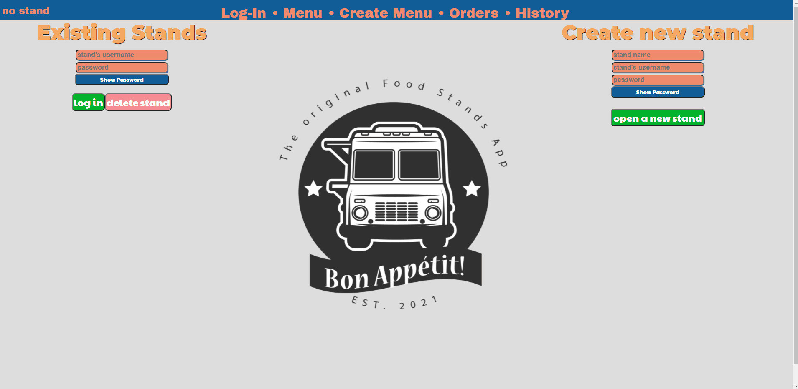
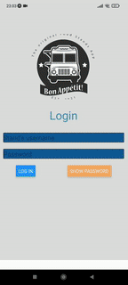

# Bon Apetit

## Cyber4s 2021 Final Project

This is a finel project of [cyber4s](https://www.timesofisrael.com/progam-arms-discharged-fighters-with-cyberskills-wins-idf-chief-of-staff-award/) 2021 course.

## Example Gifs

## usage

1. **Sign in or register** to our system with both your register machine (PC) and your cooks phones.
2. **Edit your menu:** Add dishes and drinks and add name, price, description and permanent options
3. **Order** through menu tab
4. **Control your orders** in orders and history tabs

# Running locally:
- Create .env files with the following information:
- **Server**:
- - DATABASE="final-db"
- - PASSWORD=[your password]
- - MONGO_URI=[your mongoDB URI]
- - ACCESS_TOKEN_SECRET
- - REFRESH_TOKEN_SECRET
- **Cook**: create a file called `env.js` in `cook` dir
- - IP:[check your computer IP by typing `ipconfig` in a terminal of your choise]
- - PORT: 8080
- Start the server through terminal
 `cd server
 npm start`
 - Start the register web app through terminal
 `cd client/register
 npm start`
- Start the cook mobile app through terminal
 `cd client/cook
 expo start`
 - Download [Expo Go](https://expo.io/client) on your mobile device and scan the QR code that will apper in http://localhost:19002/
 - **You're good to go!** 

## Technologies that were in use in this project:

 
  
   
  
  
  
   
  
  
  
   
  
 
     

<!-- https://drawsql.app/yuvalnakav/diagrams/restaurantdb# - sql format -->
